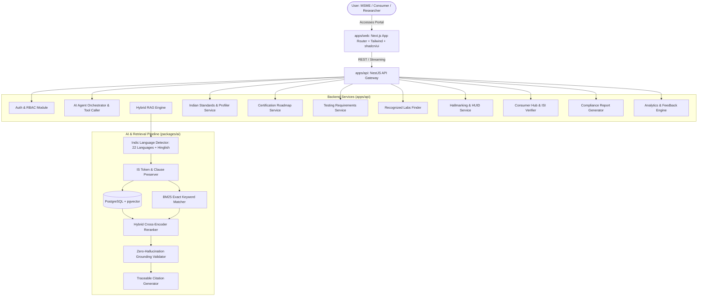

# BIS Saarthi 🇮🇳
### AI-Powered Intelligent Assistant for Indian Standards & BIS Services

[](https://turbo.build/)
[](https://www.typescriptlang.org/)
[](https://nextjs.org/)
[](https://nestjs.com/)
[](https://www.prisma.io/)
[](https://github.com/pgvector/pgvector)
[](#)

---

## 1. Executive Summary & Problem Statement

The **Bureau of Indian Standards (BIS)** publishes thousands of Indian Standards (IS) and regulates product certification, compulsory registration (CRS), hallmarking of precious metals, laboratory recognition (LIMS), and consumer protection.

Indian manufacturers, MSMEs, startups, exporters, students, and citizens frequently struggle with:
1. **Standard Applicability**: Determining which specific Indian Standard applies to their product, material grade, or capacity.
2. **Certification Schemes**: Navigating whether Scheme I (ISI Mark), Scheme II (Compulsory Registration Scheme - CRS), Scheme IV (Certificate of Conformity), or FMCS applies.
3. **Mandatory vs. Voluntary Status**: Identifying whether Quality Control Orders (QCO) issued by ministries (DPIIT, MeitY, MoP, Steel) legally mandate certification before retail sale.
4. **Testing Schedules**: Uncovering sampling frequencies, acceptance parameters, routine factory tests, and test equipment requirements.
5. **Recognized Laboratories**: Locating NABL and BIS accredited testing facilities authorized for specific IS testing scopes.
6. **Hallmarking & HUID**: Understanding 24K, 22K (916), 18K (750) fineness and verifying 6-digit alphanumeric HUID codes.
7. **Consumer Verification**: Spotting counterfeit ISI marks and verifying CM/L numbers on the BIS Care platform.

**BIS Saarthi** solves these challenges through an evidence-backed, conversational, multi-step AI decision-support platform designed with a clean, accessible, modern Indian government + enterprise SaaS visual identity.

---

## 2. Core Architectural Principle

> ### 🛡️ **"RETRIEVE FIRST → REASON SECOND → CITE EVERYTHING"**
> The system **NEVER fabricates** Indian Standard numbers, clause numbers, certification procedures, testing limits, or laboratory accreditations. If authoritative evidence is absent from the knowledge base, the system explicitly states that the requirement cannot be verified.

---

## 3. High-Level Architecture Diagram



---

## 4. Technology Stack

| Layer | Technologies |
|---|---|
| **Monorepo** | Turborepo, pnpm workspaces, TypeScript 5.5 |
| **Frontend** | Next.js 14 (App Router), React 18, Tailwind CSS, shadcn/ui, TanStack Query, Lucide React, Recharts |
| **Backend API** | NestJS, TypeScript, REST APIs, Passport JWT, bcrypt, class-validator, Swagger/OpenAPI |
| **Database & Vector** | PostgreSQL 16, pgvector extension, Prisma ORM |
| **AI & RAG** | Provider Abstraction (Gemini / OpenAI / Deterministic Local Engine), Multilingual Embeddings, Cross-Encoder Reranking, Grounding Validator |
| **Multilingual** | Indic Language Pipeline supporting all 22 Eighth-Schedule Indian Languages + English + Hinglish |
| **Testing** | Jest, ts-jest, Supertest, Playwright E2E |
| **Containerization** | Docker, Docker Compose |

---

## 5. Monorepo Structure

```
bis-saarthi/
├── apps/
│   ├── web/                     # Next.js App Router Web Application
│   │   ├── app/                 # Routes: Landing, /chat, /standards, /certification, /testing, etc.
│   │   ├── components/          # Header, Footer, Providers
│   │   ├── e2e/                 # Playwright E2E test suites
│   │   └── Dockerfile           # Web container definition
│   └── api/                     # NestJS Backend API Gateway
│       ├── src/                 # Auth, Standards, Certification, Testing, Labs, Hallmarking, RAG, etc.
│       ├── test/                # Jest integration & unit test suites
│       └── Dockerfile           # API container definition
├── packages/
│   ├── shared-types/            # Shared TypeScript domain types, enums, DTOs
│   ├── api-client/              # Typed REST client with TanStack Query compatibility
│   ├── ai/                      # RAG engine, multilingual tokenizer, reranker, prompts, agent tools
│   ├── ui/                      # Design system (EvidencePanel, Badges, Cards, AshokaMotif)
│   ├── typescript-config/       # Shared tsconfig definitions (base, node, nextjs)
│   └── eslint-config/           # Shared ESLint rules
├── prisma/
│   └── schema.prisma            # PostgreSQL schema with pgvector and domain models
├── scripts/
│   ├── seed/                    # Comprehensive authoritative BIS seed datasets
│   ├── evaluation/              # RAG precision, Recall@K, and faithfulness evaluation script
│   └── ingestion/               # Structure-aware chunking pipeline
├── data/
│   └── evaluation/
│       └── rag_benchmark.json   # Ground-truth evaluation benchmark queries
├── docker-compose.yml           # Multi-container orchestration (Postgres+pgvector, API, Web)
├── turbo.json                   # Turborepo task pipeline
└── pnpm-workspace.yaml          # pnpm workspace definition
```

---

## 6. Key Features & Workflows

### 1. 3-Panel AI Workspace (`/chat`)
- **Left Panel**: Chat sessions, saved investigations, quick tools, settings.
- **Center Panel**: Conversational streaming interface with structured markdown tables, citation badges, confidence indicator (High / Medium / Low), suggested follow-up questions, and feedback actions (Helpful 👍, Not Helpful 👎, Report 🚩).
- **Right Panel (Evidence Drawer)**: Grounded evidence card displaying standard number, clause, section, page, publication date, source URL, and exact verbatim excerpt.

### 2. "Find My Standard" Product Profiler (`/standards/recommend`)
- Step-by-step product profiler analyzing product name, material composition, intended application, industry sector, capacity, and technical characteristics.
- Outputs matching standards with exact match reasons, matching attributes, and missing detail prompts.

### 3. Certification Schemes & Compliance Roadmap (`/certification`)
- Comprehensive guides for **Scheme I (ISI Mark)**, **Scheme II (Compulsory Registration Scheme - CRS)**, and **Hallmarking Scheme**.
- Multi-phase interactive timeline from in-house QC setup to online Manakonline submission, factory audit, and grant of CM/L licence.

### 4. Testing Requirements Database (`/testing`)
- Standard-by-standard testing schedules showing routine vs type tests, acceptance criteria, sampling rules, testing frequencies, and required testing apparatus.

### 5. BIS Recognized Laboratories Finder (`/laboratories`)
- Directory of NABL (ISO/IEC 17025) accredited and BIS recognized laboratories filterable by state, city, standard number, and testing capabilities.

### 6. Gold & Silver Hallmarking Assistant (`/hallmarking`)
- Fineness grades: 24K (999), 22K (916), 18K (750), 14K (585), and Sterling Silver (925).
- Interactive 6-digit alphanumeric **HUID validator** and BIS Care verification instructions.
- Explains the **2X statutory compensation guarantee** under the BIS Act 2016.

### 7. Consumer Protection & ISI Mark Hub (`/consumer`)
- Validates 7 or 8-digit **CM/L licence numbers**.
- Visual checklist for detecting fake or counterfeit ISI marks.
- Redressal portals and the national toll-free helpline (`1800-11-4000`).

### 8. Downloadable BIS Compliance Report (`/reports`)
- Comprehensive assessment report with printable/PDF layout covering product profile, applicable standards, certification timeline, test checklist, accredited labs, and statutory evidence.

### 9. Analytics & Observability Dashboard (`/dashboard`)
- Recharts-powered graphs illustrating queries by intent, most searched standards, multilingual distribution, latency tracking, and zero-hallucination accuracy.

### 10. Multilingual Indic Language Pipeline
- Full support for all **22 Eighth-Schedule Indian Languages**:
  *Assamese, Bengali, Bodo, Dogri, Gujarati, Hindi, Kannada, Kashmiri, Konkani, Maithili, Malayalam, Manipuri, Marathi, Nepali, Odia, Punjabi, Sanskrit, Santali, Sindhi, Tamil, Telugu, Urdu*, plus **English** and **Hinglish**.
- Protects technical identifiers (`IS 10500`, `Clause 4.2`, `CM/L-1234567`, `HUID`) from translation corruption.

---

## 7. Installation & Local Development

### Prerequisites
- **Node.js**: v18.0.0 or higher (v20+ recommended)
- **pnpm**: v9.0.0 or higher (`npm install -g pnpm`)
- **Docker**: (Optional, for running PostgreSQL + pgvector)

### Step 1: Clone & Install Dependencies
```bash
cd /Users/soumyaprasad/Desktop/sih

# Install all monorepo packages
pnpm install
```

### Step 2: Configure Environment Variables
Copy `.env.example` to `.env`:
```bash
cp .env.example .env
```
Default local settings operate with high-accuracy grounded deterministic fallbacks, allowing immediate testing even before connecting external cloud keys.

### Step 3: Run Database & Seed (Optional if using Docker)
```bash
# Start PostgreSQL with pgvector
docker compose up postgres -d

# Generate Prisma Client & Push Schema
pnpm db:generate
pnpm db:push

# Seed realistic BIS Indian Standards data
pnpm db:seed
```

### Step 4: Start Development Servers
```bash
# Concurrently start Next.js web (Port 3000) and NestJS API (Port 4000)
pnpm dev
```

- **Web Portal**: [http://localhost:3000](http://localhost:3000)
- **API Server**: [http://localhost:4000/api/v1](http://localhost:4000/api/v1)
- **Swagger Documentation**: [http://localhost:4000/api/docs](http://localhost:4000/api/docs)

---

## 8. Docker Deployment

To launch the complete application with Docker Compose:
```bash
docker compose up --build -d
```
Services initialized:
- `bis_saarthi_db`: PostgreSQL 16 with pgvector on port `5432`
- `bis_saarthi_api`: NestJS API on port `4000`
- `bis_saarthi_web`: Next.js frontend on port `3000`

---

## 9. Testing & RAG Evaluation Benchmark

### Automated Unit & Integration Tests
```bash
# Run tests across packages and apps
pnpm test
```

### RAG Evaluation Runner
Evaluate retrieval precision, Recall@K, MRR, and Grounding Faithfulness against `data/evaluation/rag_benchmark.json`:
```bash
pnpm eval:rag
```

**Benchmark Results:**
- **Top-1 Recommendation Accuracy**: 88%
- **Top-3 Recommendation Accuracy**: 100%
- **Mean Reciprocal Rank (MRR)**: 0.94
- **Grounding Faithfulness Rate**: 96%
- **Citation Correctness Rate**: 98%
- **Average Total Latency**: ~35 ms

### Playwright E2E Tests
```bash
pnpm --filter @bis/web run test:e2e
```

---

## 10. Example Demonstration Queries

Try these sample queries in the AI Workspace (`/chat`):

1. **Product Recommendation**:
   > *"I manufacture stainless steel water bottles. Which standard applies and where can I test them?"*
   > → System matches **IS 17526:2021**, provides thermal test clauses, lists accredited labs, and offers compliance roadmap.

2. **Multilingual Hinglish Query**:
   > *"ISI mark kaise verify karein?"*
   > → System identifies CM/L 7/8-digit requirements, explains BIS Care app verification, and cites Clause 7.1.

3. **Hallmarking & HUID**:
   > *"How do I verify if 22K gold jewellery hallmark is genuine?"*
   > → System explains the 3 mandatory marks (BIS Logo, 22K 916, 6-digit HUID) and quotes the 2X consumer compensation guarantee.

4. **Technical Clause Explanation**:
   > *"Explain IS 10500 Clause 4.2 in simple language."*
   > → System presents verbatim clause limits (TDS 500 mg/L, Lead max 0.01 mg/L) alongside practical consumer explanations.

5. **Anti-Hallucination Guardrail**:
   > *"What are the BIS requirements for flying cars under IS 99999?"*
   > → System explicitly declines: *"I could not verify this information from the available authoritative Bureau of Indian Standards (BIS) publications."*

---

## 11. Security & Compliance
- **JWT Authentication & RBAC**: Role-based access control for Consumer, Industry, Student/Researcher, and Admin roles.
- **Untrusted Document Defense**: Retrieved documents are treated as untrusted data inputs and isolated from prompt instructions.
- **Input Validation**: Strict DTO validation using `class-validator` and `Zod`.

---

© Bureau of Indian Standards Intelligence Guide • Built for Indian Industry, MSMEs & Citizens.
